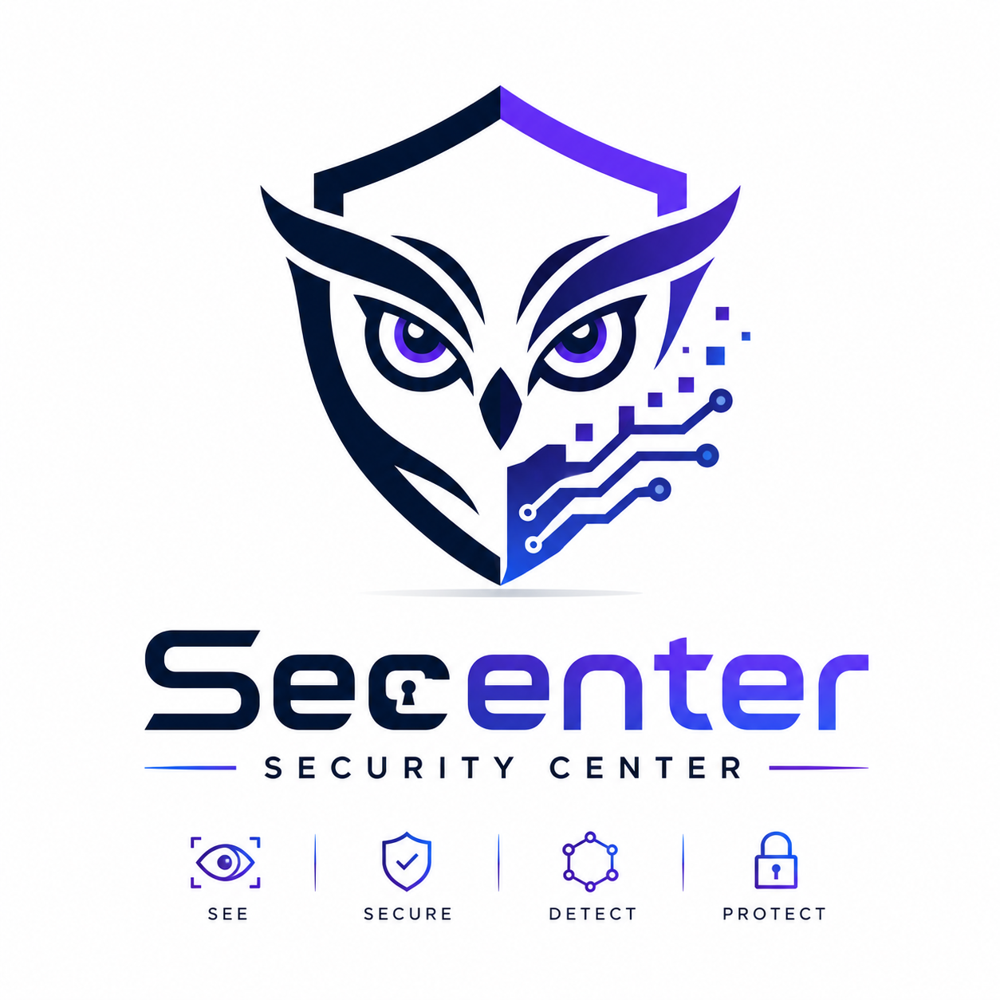

# Secenter — Security Center DevSecOps

Security Center DevSecOps for Visual Studio Code.

## Overview

Security Center DevSecOps is a unified developer security workspace inside VS Code. It brings local scanning, security findings, dynamic testing workflows, supply-chain evidence, runtime and infrastructure context, CI/CD delivery evidence, audit events and policy checks into one extension.

The extension is local-first: scanners and optional integrations are explicit, external services remain optional, and credentials are stored with VS Code SecretStorage rather than in workspace settings.

## Features

- Security Dashboard with scanner health, security posture and domain cards.
- Findings view with normalized vulnerabilities, secrets and dependency issues.
- Workspace scans with Semgrep, Gitleaks, Trivy, OSV-Scanner, SonarQube, Snyk and OWASP ZAP support.
- Scan history, scan comparison, trends and SARIF export.
- Dynamic Security workflows for ZAP, Burp/HAR traffic, safe replay and targeted retest.
- Security Pipeline with correlation, reachability, priority, Policy Gate and supply-chain evidence.
- SBOM generation, provenance structure, Cosign signing and license analysis.
- Runtime Security provider model with Wazuh implemented first.
- Infrastructure Observability provider model with Prometheus implemented first.
- Security Delivery provider model with Jenkins implemented first.
- Local AI / Ollama-assisted remediation with explicit validation and rollback support.
- Audit journal, project policy and integration configuration pages.

## Supported Tools

### Application Security

- Semgrep: Implemented.
- Gitleaks: Implemented.
- Trivy workspace analysis: Implemented.
- OSV-Scanner: Implemented.
- SonarQube: Implemented when a reachable SonarQube server and token are configured.
- Snyk: Implemented when a Snyk account and token are configured.

### Runtime Security

- Wazuh: Implemented.
- Elastic, Splunk, Sentinel, QRadar, Chronicle, Graylog, ArcSight and Sumo Logic: catalogue/provider model only unless an adapter is present in this build.

### Observability

- Prometheus: Implemented.
- Zabbix, Datadog, New Relic, InfluxDB and OpenTelemetry: catalogue/provider model only unless an adapter is present in this build.

### CI/CD

- Jenkins: Implemented for job/build status and archived Security Center reports.
- GitLab CI/CD, GitHub Actions, Azure DevOps Pipelines, CircleCI and Bitbucket Pipelines: catalogue only. Provider referenced, adapter unavailable in this preview version.

### AI

- Ollama: Implemented as a local provider for fix suggestions and validation-aware remediation workflows.

### Dynamic Security

- OWASP ZAP: Implemented for local passive/active workflows with explicit authorization.
- Burp Suite: Implemented through local capture/import workflows and the bundled connector artifact.

## Requirements

- VS Code compatible with the `engines.vscode` version in `package.json`.
- Docker for container-based scanner execution and optional local lab services. Scanners only — the Security Center backend does not need it.
- No requirement for the Security Center backend: the local backend service ships with the extension and is started, supervised and stopped automatically. Neither Docker nor Python is involved.
- Optional SonarQube server for SonarQube scans.
- Optional Snyk account and token for Snyk scans.
- Optional Jenkins server and API token for Security Delivery.
- Optional Wazuh manager for Runtime Security.
- Optional Prometheus server for Infrastructure.
- Optional Ollama server for local AI features.
- Optional OWASP ZAP and Burp Suite for dynamic testing workflows.

When an optional service is absent, the related feature reports a not configured, unavailable or degraded state. The whole extension should not appear broken because one optional provider is offline.

## Getting Started

1. Install the VSIX or install the extension from the Marketplace once published.
2. Open a workspace in VS Code.
3. Run `Security Center: Open Dashboard`.
4. Open scanner configuration and choose the scanners you want to run.
5. Run `Security Center: Scan Workspace`.
6. Review findings, scan history, Security Pipeline and any configured integration domains.

## Security Center Backend

The backend persists scan history, the audit journal, trend/MTTR data and the HTTP scenarios captured from Burp. It is part of the extension, not a prerequisite for it.

**Local backend is managed automatically by the extension.** On first use it starts on the loopback interface, binds `127.0.0.1` only, and stores its data in the VS Code global storage folder so extension updates never delete the history. There is nothing to install: no Docker, no Python, no separate download. The service runs on the Node runtime VS Code already provides.

Scanning, Live Security, Fix & Verify and the scanner integrations work whether or not the backend is running. Only the history-based surfaces depend on it.

Status, address, version and the `Test connection` / `Restart backend` actions are in **Integrations → Security Center Backend**.

### What the backend is not

The Secenter backend is an internal service of the extension. It is not the application you analyse, and the two never share a role:

| | Secenter backend | Analysed application (e.g. OWASP Juice Shop) |
| --- | --- | --- |
| Started by | the extension, automatically | you, separately |
| Default address | `127.0.0.1:8765` | its own, e.g. `127.0.0.1:3000` |
| Purpose | scan history, trends/MTTR, audit journal, HTTP scenarios, Burp ingestion, exports | the target under test |
| If it is down | history-based pages degrade and say so | dynamic analysis has no target |

ZAP and Burp point at the **application** URL. Scanners, Live Security and Fix & Verify never contact the backend: an offline backend does not prevent analysing a workspace, it only means the run is not persisted. The workspace name shown in the Dashboard is read from VS Code itself and never depends on the backend being reachable.

### Advanced / Remote backend

Teams can point the extension at a backend their organization operates:

- `Security Center: Configure backend` → **Remote**
- `securityCenter.backend.url` → for example `https://security.company.internal`

In Remote mode the extension starts nothing; it uses the configured backend and reports its state.

### Burp connector

The connector reads the active backend address and API key from `~/.security-center/backend.json`, which the extension writes whenever the backend comes online. The address is never hard-coded in the connector, so a changed port or a switch to Remote mode is picked up with **Recharger la configuration**.

## Integrations

Integrations are organized by domain:

- Runtime Security for SIEM/runtime providers.
- Infrastructure for observability providers.
- Security Delivery for CI/CD providers.
- Team notifications for Slack and Jira workflows.

Only implemented adapters expose Test connection and Save configuration actions. Catalogue-only providers are listed to show planned provider coverage, but they do not expose fake forms or simulated capabilities.

## Security Model

- Secrets are stored in VS Code SecretStorage.
- Workspace settings store only non-secret configuration such as endpoint URLs, usernames, project names and boolean options.
- Active scans and write-capable dynamic replay paths require explicit user action or consent.
- Fix & Verify validates remediation through the existing scanner/retest path before marking a finding as validated.
- Local AI support is local-first through Ollama and uses redaction before sending context to the model provider.
- Security Delivery reads CI/CD evidence; it does not trigger builds or deploy applications.

## Preview Status

This extension is currently provided as a preview version as part of an engineering project. APIs, integrations and user interfaces may evolve.

## Known Limitations

- Jenkins is the only implemented Security Delivery provider in this preview.
- Some runtime and observability providers are present as catalogue entries before their adapters are implemented.
- Optional external services must be installed and configured separately.

## Privacy

Security Center works primarily against the open VS Code workspace and user-configured local or external tools. Scanner results, audit events and integration data may be sent to the configured local backend or provider endpoints when those features are used. Secrets are not written to `settings.json`, rendered into webviews, or intentionally logged by the extension.

## License

MIT. See [LICENSE](LICENSE).
